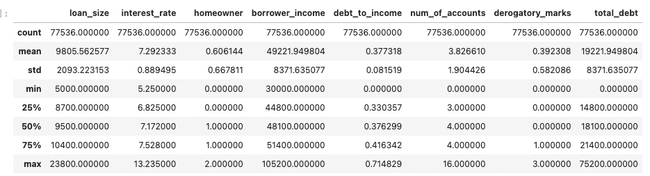
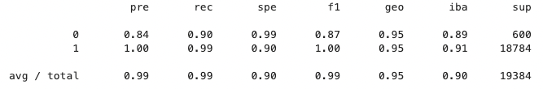
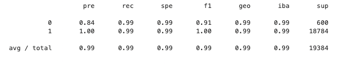
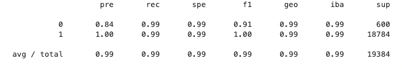
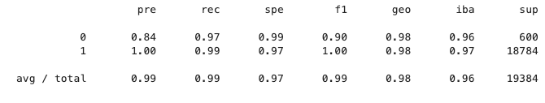
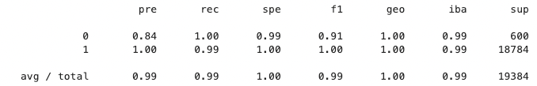
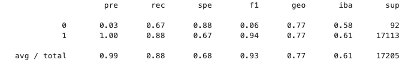
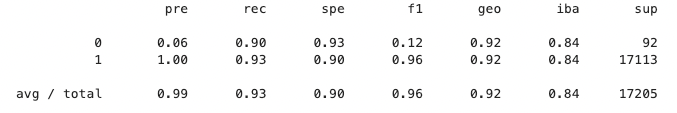

# Unit-11---Risky-Business

## Background

Mortgages, student and auto loans, and debt consolidation are just a few examples of credit and loans that people seek online. Peer-to-peer lending services such as Loans Canada and Mogo let investors loan people money without using a bank. However, because investors always want to mitigate risk, a client has asked that you help them predict credit risk with machine learning techniques.

In this assignment you will build and evaluate several machine learning models to predict credit risk using data you'd typically see from peer-to-peer lending services. Credit risk is an inherently imbalanced classification problem (the number of good loans is much larger than the number of at-risk loans), so you will need to employ different techniques for training and evaluating models with imbalanced classes. You will use the imbalanced-learn and Scikit-learn libraries to build and evaluate models using the two following techniques:

1. Resampling
2. Ensemble Learning

----

# Analysis

## Credit Risk Resampling Techniques

In this section, I have used the imbalanced learn library to resample the LendingClub data, then I have built and evaluated the logistic regression classifiers using the resampled data.

### Simple Logistic Regression:

### Oversampling:

In this section, I have compared two oversampling algorithms to determine which algorithm results in the best performance.

### Naive Random Oversampling:

### SMOTE Oversampling:

### Undersampling:

In this section, I have tested an undersampling algorithm to determine which algorithm results in the best performance compared to the oversampling algorithms above.

### Combination (Over and Under) Sampling:

In this section, I have tested a combination over- and under-sampling algorithm to determine if the algorithm results in the best performance compared to the other sampling algorithms above.

## Final Questions:

#### 1. Which model had the best balanced accuracy score?
The SMOTE Oversampling and Undersampling have the best balanced accuracy score: 99.45%

#### 2. Which model had the best recall score?
Overall all models have a great recall score: 100%

#### 3. Which model had the best geometric mean score?
The combination of (Over and Under) sampling algorithm got the best geometric mean   score: 100%

----

# Ensemble Learning:

In this section, I have trained and compared two different ensemble classifiers to predict loan risk and evaluate each model. 

### Balanced Random Forest Classifier:

### Easy Ensemble Classifier:

## Final Questions:

#### 1. Which model had the best balanced accuracy score?
The Easy Ensemble Classifier has the best balanced accuracy score 92%.

#### 2. Which model had the best recall score?
The Easy Ensemble Classifier has the best recall score 93%.

#### 3. Which model had the best geometric mean score?
The Easy Ensemble Classifier has the best geometric mean score 92%.

#### 4. What are the top three features?
The top three features are:
    
1. Initial List Status = 8.23%
2. Total Acc = 7.51%
3. Out Prncp = 5.3%
